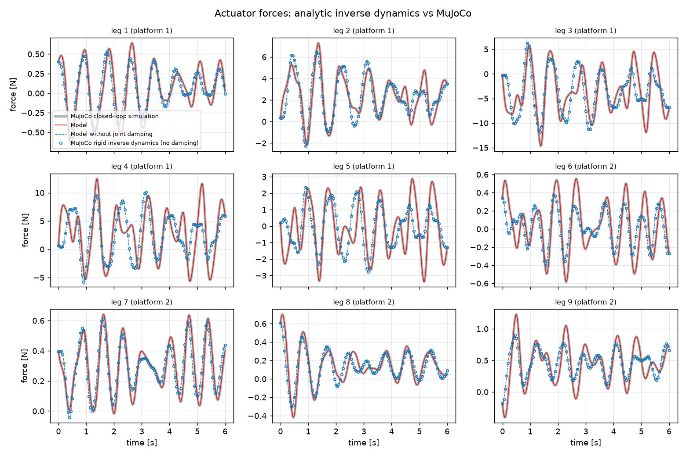
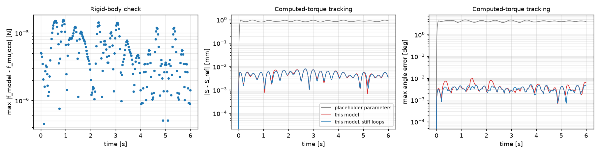

# Validation of the inverse dynamic model

The analytic inverse dynamics of the 5<u>P</u>SS-S-4<u>P</u>SS robot
(`ninedof_kinematics/dynamics.py`) is compared with MuJoCo on a trajectory
that moves all nine pose coordinates at once. Reproduce with

```bash
python3 -m ninedof_mujoco.validate_dynamics --plot docs   # ~2.5 min, output in dynamics_validation.out
```

## Model

Principle of virtual work with the matrices of the kinematic paper,
**J** ċ = **K** q̇, ċ = [ṗ, ω₁, ω₂]:

    f = K J⁻ᵀ τ_c + (m_s + m_a) q̈ − m_s g·e
    τ_c = Σ_b (J_v,bᵀ m_b (a_b − g) + J_ω,bᵀ (I_b ω̇_b + ω_b × I_b ω_b + damping))

over the two platforms (full inertia tensor, centre of mass off the joint S)
and the nine SS distal links (no spin about their axis,
ω_i = m_i × ṁ_i / l²). The actuator acceleration comes from
q̈_i = (|ṁ_i|² + m_i·a_Ai) / (m_i·e_i). Viscous friction of the ten ball
joints is included.

## Parameters (`ninedof_description/config/dynamics.yaml`)

Estimates. None of these parts have been weighed. The centre of mass and the
inertia tensors come from the CAD meshes scaled to these masses
(`scripts/mass_properties.py`).

| Part | Mass | Notes |
|---|---|---|
| slider (×9) | 15 g | rod + nut + ball of a micro linear actuator |
| distal link (×9) | 5 g | PLA rod (2.2 g) + two ball sockets |
| platform 1 / 2 | 25 g each | PLA + ball studs and screws; **centre of mass 17.8 mm off the axis** (−15.8, 7.5, 2.8) mm |
| actuator armature | 10 g | reflected inertia of the drive |
| ball-joint damping | 0.0005 N m s/rad | |

The earlier placeholders put the platform centre of mass on the axis and used
the bare PLA volume (1.7 g sliders, 12.7 g platforms).

## Results



**1. Rigid-body check.** MuJoCo writes the robot as a tree (sliders, distal
links on ball joints, a free platform 1, platform 2 on the central ball joint)
closed by 27 equality rows. On 241 points of the trajectory,
M q̈ + c = Sᵀ f + Gᵀ λ is solved with MuJoCo's M, c and constraint Jacobian G.
This is MuJoCo's own rigid answer, independent of the virtual-work
derivation.

| | |
|---|---|
| peak actuator force | 11.84 N |
| max \|f_model − f_MuJoCo\| | 1.6 × 10⁻⁵ N (static poses: 10⁻⁸ N) |
| least-squares residual | 4.5 × 10⁻⁸ |

**2. Closed loop.** The position servos are replaced by force motors driven by
a computed-torque law built on the model (10 Hz task-space PD on the measured
platform state). MuJoCo integrates the robot with its soft loop closures and
joint damping. With an exact model the error is only what MuJoCo itself
adds.

| | this model | + stiff loops | placeholder parameters |
|---|---|---|---|
| max position error of S | 7.1 µm | 7.1 µm | 974 µm |
| max angle error | 0.010° | 0.005° | 4.73° |
| max \|f − f_model\| | 0.067 N | 0.022 N | 2.94 N |
| loop-closure gap | 17 µm | 0.16 µm | 17 µm |



The remaining difference comes from MuJoCo's soft loop closures. Raising
their impedance to the maximum (0.9999) cuts the force difference by three.

Unit tests (`test/test_dynamics.py`) also check the model without MuJoCo,
using positions only:

- the static forces equal the gradient of the potential energy through the
  forward kinematics;
- f·q̇ = d(T+U)/dt + the power dissipated in the ball joints;
- Σf equals the total weight.

## Findings

1. **Weak direction at home.** The nine distal links are almost vertical
   (u_z ≈ 0.99). The smallest singular value of K⁻¹J is 1.2 × 10⁻⁴ m/rad,
   and the homogenised condition number is about 1400. The weak motion
   combines a horizontal translation of S and a rotation of platform 2 about
   Z. Consequences:
   - With position servos of 50 kN/m and no other control, gravity acting on
     the off-axis centre of mass turns platform 2 by more than 70° while the
     actuators move less than 0.2 mm. MuJoCo shows this with any loop
     stiffness, so it is not a simulation artefact.
   - A joint-space PD cannot hold the pose: the actuators hardly see the weak
     mode. Pose feedback (computed torque) holds it to micrometres.
2. **Joint friction matters.** A viscous friction of only 0.0005 N m s/rad in
   the ball joints changes the actuator forces by up to 2 N, which is 17 % of
   the peak. The same conditioning amplifies it. The friction of the real
   ball joints should be identified.
3. **MJCF assembly.** The geometry is rounded to 0.01 mm, so the exact
   inverse kinematics gives q = 2–9 µm at home, not 0. The generated model
   assembled the legs at q = 0, which shifted the loop-closure anchors by up
   to 8.6 µm. That was enough for 8 × 10⁻⁴ N of force error. The sliders are
   now built at q_home (`ref` of the slide joint) and the anchors match the
   attachment points to 10⁻¹⁰ m.
