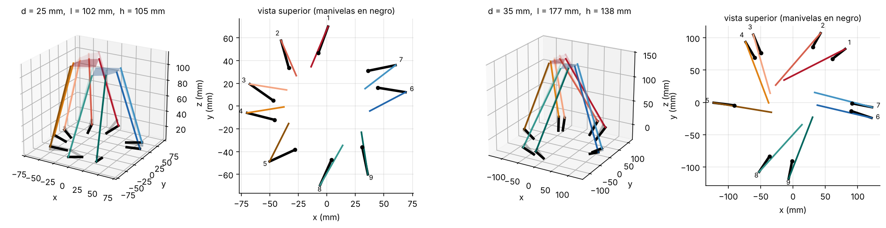
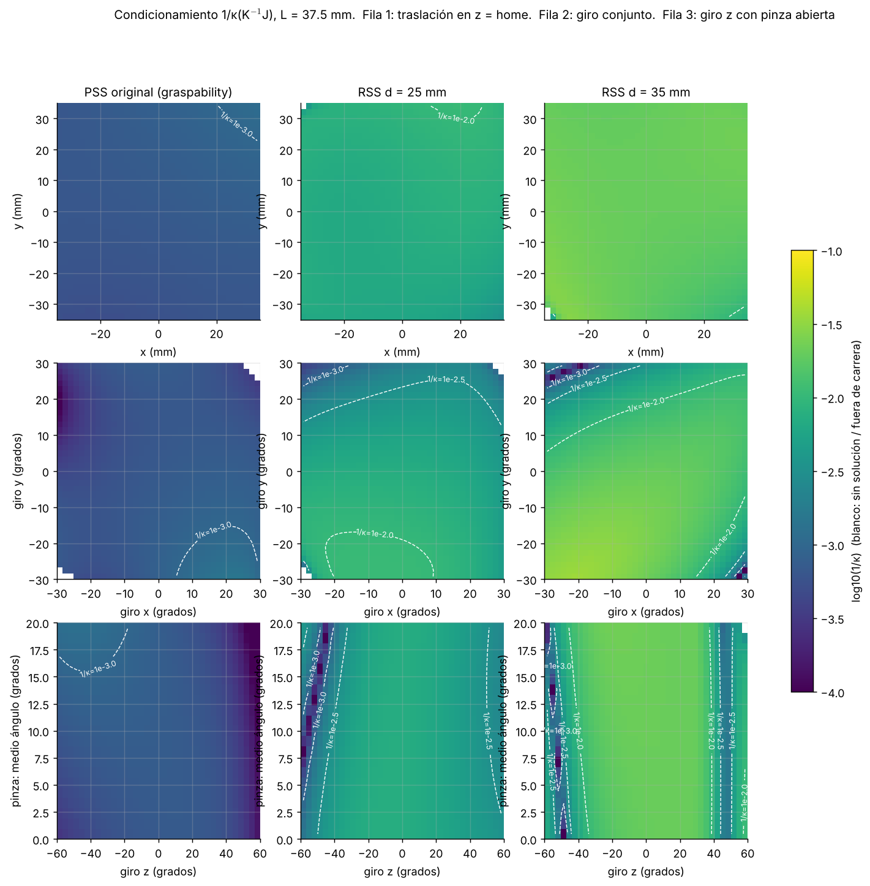
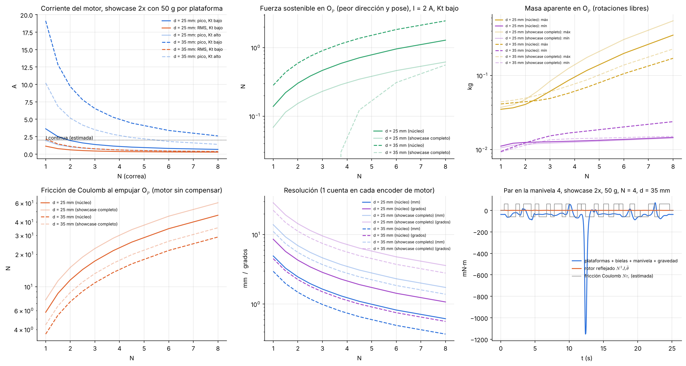
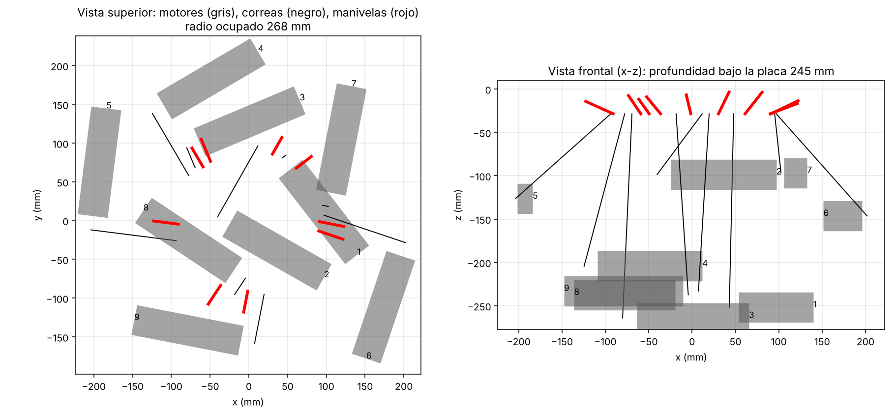
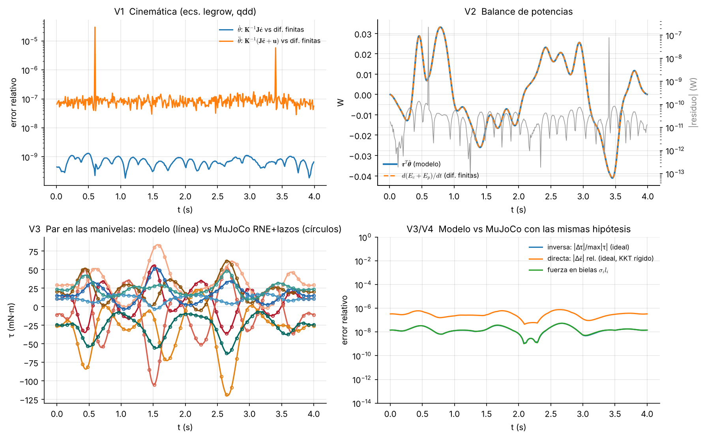
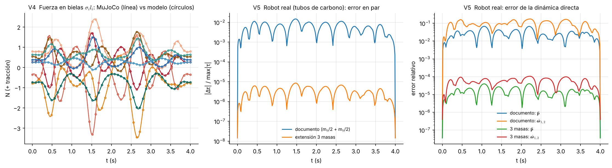
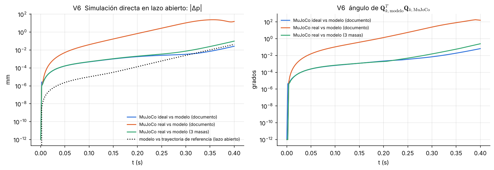

# 5<u>R</u>SS-S-4<u>R</u>SS: dimensionamiento, factibilidad con los motores del robot de 3 rotaciones ilimitadas y validación del modelo dinámico

Versión con manivelas (actuadores rotativos en la base) del robot de 9 GDL con
capacidad de agarre de este repositorio. Las dos plataformas, sus rótulas y la
rótula central son las del CAD de graspability sin cambios
(`src/ninedof_description/config/geometry.yaml`, mallas `platform_1.stl`,
`platform_2.stl`). Los actuadores son los Matsushita MPX-40C4WA del robot
`3_unlimited_rotation`, con una correa GT2 por pata. Plataformas, rótulas,
manivelas y poleas se imprimen en PA12 por fusión de polvo, y las bielas son
tubos de fibra de carbono.

El modelo dinámico se implementó ecuación por ecuación desde el documento
(`model.py`) y se comparó con cálculos independientes en MuJoCo.

## Resumen

| Pregunta | Respuesta |
|---|---|
| ¿Manivela de 25 o 35 mm? | **35 mm.** Con la plataforma CAD, la de 25 mm queda limitada por el ángulo de transmisión: κ en home 137 frente a 50, y en el núcleo de trabajo 1/κ = 0.0057 frente a 0.015. |
| Dimensiones recomendadas | d = 35 mm, biela l = 177 mm, altura de Op sobre los ejes h = 138 mm, puntas de manivela a 111 mm del centro, ejes de manivela a 91 mm (tabla completa más abajo). |
| ¿Bien condicionado? | **Mucho mejor que el original, aunque no isótropo.** κ en home es 50 (PSS original: 1435), y en el núcleo de trabajo κ ≤ 67. La dirección débil es el giro alrededor de z de cada mitad, sobre todo de la mitad de 4 patas. El giro conjunto en z útil es **±30°**: cerca de −50° hay una banda casi singular. |
| ¿Sirven los motores? | **Sí, con N = 4 (GT2 16T→64T) y un encoder magnético de 14 bit en cada manivela.** El par sobra en el núcleo de trabajo (0.6 A RMS en el showcase al doble de velocidad con 50 g por plataforma). Los encoders de 500 PPR del motor son el límite real: con N = 3 y sólo esos encoders, el control de impedancia satura y se pierde. |
| ¿Amplificar con la correa? | Moderadamente. N mayor da par y resolución, pero la inercia del rotor (N²J) y la fricción del motor (N·τc) crecen y empeoran el pHRI. N = 4 es el compromiso que funcionó en todas las simulaciones. |
| ¿El modelo dinámico es correcto? | **Sí, es exacto bajo sus hipótesis.** Coincide con MuJoCo a 5·10-8 en par y 2·10-7 N en las fuerzas de biela, y el balance de potencia cierra a 2·10-7 W. |
| ¿Hay algo que corregir? | El reparto **mb/2 + mb/2** de la biela no es adecuado para este robot: las 9 bielas de carbono (58 g) pesan 3 veces más que las dos plataformas (19 g). Con ese reparto, el par se equivoca un 1.5 % pero la aceleración de la plataforma hasta un 17 %, y en lazo abierto la simulación diverge en 0.4 s. Con la extensión de 3 masas (`latex/biela_tres_masas.tex`), el error baja a 10-5 en par y 10-4 en aceleración, sin cambiar la estructura del modelo. No encontré errores en las derivaciones del documento. |
| pHRI | En simulación, con impedancia cartesiana y el modelo como compensación, el robot cede 26 mm ante 6 N. La fuerza del humano se estima **sin sensor de fuerza** (observador de momento con Ma, ca, ga) con 0.38 N RMS de error y 2 N de pico. |

Interpretación de "eslabón bajo de 25 o 35": tomé la manivela en **mm**,
porque coincide con la carrera de ±25 mm del actuador lineal que reemplaza.
Si se pensaba en 25–35 **cm** (la escala de los brazos del robot de 3
rotaciones), esas manivelas son incompatibles con plataformas de 37 mm de
radio. Para usar esa escala habría que agrandar la plataforma, y escalarla
×1.5 o ×2 con d = 35 mm **no** mejoró el condicionamiento (ver más abajo).

## Contenido

| Archivo | Qué hace |
|---|---|
| `model.py` | Modelo del documento: J, K, u, Mc, hc, gc, dinámica inversa (ecs. qinv, laminv, fi), forma en actuadores (fq), dinámica directa mínima (directa), energía, cinemática directa. Incluye la extensión de 3 masas. |
| `geometry.py`, `design.py` | Parametrización RSS sobre los ángulos de base del CAD y optimización (evolución diferencial + Nelder–Mead) con restricciones. |
| `params.py` | Masas e inercias: PA12 (0.95 g/cm³), carbono 6/4 mm, acero, motor (datos y estimaciones marcadas como ESTIMATE). |
| `mjcf.py`, `mjbridge.py` | Modelos MuJoCo `ideal` (hipótesis del documento) y `real` (tubo con masa distribuida, rotor, fricción), y el paso de estados entre modelo y MuJoCo. |
| `validate.py` | Validación V1–V6 → `figures/validation_*`, `results/validation_d35_core.json`. |
| `feasibility.py`, `ctrl_study.py` | Motores y relación N; estudio N × encoder en lazo cerrado. |
| `motor_layout.py` | Ubicación de los 9 motores y correas bajo la base. |
| `control.py`, `closed_loop.py`, `animate.py` | Encoders, cinemática directa, impedancia, observador de momento, simulaciones en lazo cerrado y videos. |
| `latex/biela_tres_masas.tex` | Sección para añadir al documento (masa distribuida de la biela). |
| `run_all.sh` | Regenera todo (unas 2 h en 4 núcleos). |

## 1. Dimensionamiento

Cada actuador lineal vertical del CAD se reemplaza por una manivela de eje
horizontal colocada en el mismo ángulo de base ψi. Variables
comunes a las 9 patas: radio de las puntas Rt, giro tangencial de
las puntas por plataforma (Δψ1, Δψ2) y alternado entre
patas, orientación γ y elevación β de la manivela en home, longitud de biela l
y altura h.

Restricciones, en todas las poses del showcase del robot original
(±30/±30/±15 mm, ±20°, ±45° en z, pinza 30°, círculo y cono) más 40 poses
combinadas:

- solución de cinemática inversa y recorrido de manivela ≤ 100°;
- transmisión |Kii|/(l d) ≥ 0.5, es decir, ángulo entre biela y velocidad de la punta ≤ 60°;
- rótula de la manivela tipo rod-end con perno paralelo al eje: desalineación ≤ 30°;
- rótula de la plataforma (PA12): cono ≤ 40° alrededor de su eje de asiento;
- distancias mínimas: biela–biela 9 mm, biela–manivela 9 mm, manivela–manivela 12 mm.

Objetivo: el peor 1/κ(K-1J diag(L,L,L,1,…)), con L = 37.5 mm, sobre un
*núcleo* alrededor de home (mitad de las amplitudes, pinza hasta 30°),
exigiendo además 1/κ ≥ 1.5·10-3 en todo el showcase. Primero
optimicé el peor caso sobre todo el showcase: el óptimo quedaba dominado por
los extremos (giro z de ±45°) y era peor justo donde ocurre la interacción.

| | d = 25 mm | **d = 35 mm** | PSS original |
|---|---|---|---|
| biela l (mm) | 102 | **177** | 120 |
| altura h de Op (mm) | 105 | **138** | 147 |
| radio de puntas / de ejes de manivela (mm) | 70 / 47 | **111 / 91** | 50 |
| elevación de manivela en home β | −13° | **55°** | — |
| κ en home | 137 | **50** | 1435 |
| 1/κ mínimo en el núcleo | 0.0057 | **0.015** | 0.0006 |
| 1/κ mínimo en todo el showcase | 0.0015 | **0.0035** | 0.0003 |

Restricciones activas en d = 35 mm: transmisión (0.50), distancia biela–biela
(9.1 mm), manivela–manivela (12.0 mm) y cono de rótula de plataforma (39.7°).
El recorrido máximo de manivela es 59° y la desalineación del rod-end 16°.

Lo que limita el condicionamiento es la plataforma del CAD: anclajes a 37 mm,
coplanares con la rótula central, y sólo 4 patas en la mitad azul. Con d = 35
mm, escalar la plataforma ×1.5 dio un óptimo peor (1/κ = 0.0053) y ×2 no
encontró diseños factibles. Si en algún momento se rediseña la plataforma, lo
que más ayudaría es sacar los anclajes del plano de la rótula central.

## 2. Motores y transmisión

Datos del MPX-40C4WA: 24 V, 3580 rpm, 0.30 A en vacío, encoder de 500 PPR.

La hoja de datos es contradictoria. Los cuatro puntos de ensayo dan una
pendiente de 0.12 N·m/A, pero 3580 rpm a 24 V limitan Ke = Kt
≤ 0.064 N·m/A. Además, a 5 A el ensayo da 0.47 N·m, más de lo que permite
Kt = 0.064. Uso el valor bajo, conservador, y recomiendo medir
Kt (palanca y balanza con rotor bloqueado). El documento del robot de
3 rotaciones usa 0.12. La inercia del rotor (1·10-5 kg·m²), la
fricción de Coulomb (0.015 N·m en el motor) y la corriente continua (2 A) son
estimaciones.

- **Inercia:** con N = 4, la inercia reflejada del rotor (1.6·10-4 kg·m²) es 18 veces la de la manivela con su polea (9·10-6). Para las manivelas, el robot es sobre todo "rotores".
- **Par:** en el showcase al doble de velocidad con 50 g por plataforma, la corriente RMS es 0.6 A con N = 4. El pico, 5.3 A con Kt bajo o 2.8 A con Kt alto, aparece sólo en los extremos (giro z ±45°, cono), donde la plataforma se acerca a la banda casi singular.
- **pHRI:** sin compensar, la fricción de Coulomb que se siente al empujar Op en traslación pura es de unos 16 N en la peor dirección con N = 4. Es intrínseca: N·τc/d por pata ≈ 1.7 N. La compensación de fricción con el modelo es imprescindible. La masa aparente en Op es de 18 a 69 g.
- **Resolución:** un conteo del encoder del motor con N = 4 equivale a ~0.7 mm o ~1° en la dirección débil, y eso es lo que falla en lazo cerrado. Un AS5048A (14 bit, absoluto) en cada manivela lo mejora 2× y además resuelve la calibración de ceros, que fue el problema del giro en y del robot de 3 rotaciones.

Estudio en lazo cerrado (`results/ctrl_study_d35_core.json`; MuJoCo real,
showcase ×2 con 50 g y pHRI con empujes de 6 N):

| N, encoder | seguimiento: error máx. | pHRI: error de fuerza estimada |
|---|---|---|
| 3, motor | 2.2 mm / 3.7° (satura) | 9.6 N máx. (inestable) |
| 4, motor | 0.67 mm / 1.6° | 4.2 N máx., 1.0 N RMS |
| 6, motor | 0.78 mm / 1.8° | 2.4 N máx., 0.54 N RMS (satura a 1.8 N·m) |
| 3, 14 bit en la manivela | 0.70 mm / 1.1° | 8.6 N máx., 1.1 N RMS |
| **4, 14 bit en la manivela** | **0.42 mm / 0.64°** | **2.0 N máx., 0.38 N RMS** |

Correas: polea motriz GT2 16T y polea de manivela de 64T en PA12 (Ø 40.7 mm),
eje de motor paralelo al de la manivela, con el motor colgando bajo la placa
base. La ubicación y la longitud de cada correa están en
`results/motors_d35_core.json`. Los 9 motores (Ø 51 × 140 mm, brida de 67 mm)
caben sin interferencias con motores ni correas en un radio de **268 mm** y
**245 mm** bajo la placa base, con distancias entre centros de correa de 69 a 237 mm
(correas cerradas GT2 de 101 a 269 dientes). Son los motores, no el mecanismo (ejes de manivela a 91 mm), los
que fijan el tamaño del robot.

## 3. Validación del modelo dinámico

Cada comprobación compara el modelo con algo calculado por otro camino. La
trayectoria es multiseno en los 9 GDL, con 20 g por plataforma, en el diseño
d = 35 mm.

| | Comparación | Resultado |
|---|---|---|
| V1 | θ̇ = K-1Jċ y θ̈ = K-1(Jc̈+u) frente a diferencias finitas de la cinemática inversa | 1.3·10-9 y 3·10-5 (error propio de las diferencias finitas) |
| V2 | ½ċTMcċ frente a la energía cinética sumada cuerpo a cuerpo | 3·10-16 |
| V2 | τTθ̇ frente a d(Ec+Ep)/dt | residuo 2·10-7 W de 0.04 W |
| V3 | dinámica inversa frente a MuJoCo (Newton–Euler recursivo en el árbol + fuerzas de lazo con el jacobiano de restricción de MuJoCo, modelo `ideal`) | 5·10-8 relativo |
| V3 | dinámica directa (ec. directa) frente a la directa rígida (KKT) con M, sesgo y Jc de MuJoCo | 8·10-7 |
| V4 | σili frente a las fuerzas de lazo de MuJoCo | 2·10-7 N de 3.5 N |
| V5 | robot `real` (tubo con masa distribuida): reparto del documento / 3 masas | par 1.5 % / 9·10-6; aceleración 17 % / 1·10-4 |
| V6 | simulación en lazo abierto, 0.4 s, mismos pares: modelo (RK4, ec. directa) frente a MuJoCo nativo | ideal: 0.03 mm / 0.07°; real con el reparto del documento: diverge (24 mm, 180°); real con 3 masas: 0.1 mm / 0.25° |

Observaciones sobre el documento:

1. Las ecuaciones implementadas (legrow, qdd, Mc, hcgc, fi, laminv, fq, Mx, directa) son correctas. Las forma inversa, en actuadores y mínima directa son consistentes entre sí: la ida y vuelta inversa → directa cierra a 10-13.
2. La hipótesis de biela sin masa, o con mb/2 + mb/2, debería discutirse en el texto para este prototipo. `latex/biela_tres_masas.tex` propone la sección con la misma notación: el equivalente de 3 masas entra como una carga ½fci en cada rótula, (deflam) y (fi) sólo ganan un término, y la inversa sigue siendo un sistema de 9×9.
3. En la dinámica directa, "la matriz de la izquierda es invertible" requiere además Kii ≠ 0 (fuera de las singularidades de tipo I), porque Wm usa Kl-1.
4. Puntuación: tras la ec. (mm1) la frase termina en coma y la siguiente empieza con mayúscula.
5. MuJoCo calcula la inercia de mallas no estancas con el casco convexo: las plataformas STL saldrían un 40 % más pesadas. Aquí se usan las propiedades exactas de la malla en los dos modelos.

## 4. Simulaciones y videos

- `videos/tracking_d35_core.mp4`: showcase al doble de velocidad (giro z limitado a ±30°), 50 g por plataforma, robot `real` con encoders de 14 bit. A la izquierda el robot; a la derecha, el par aplicado en MuJoCo frente al par predicho por el modelo, y el error con y sin modelo. Sólo PD: 10 mm / 20°. PD + modelo: 1.5 mm máx. (0.25 mm RMS) / 4.5°.
- `videos/phri_d35_core.mp4`: modo impedancia; un "humano" empuja 6 N en x, z e y y abre la pinza con un momento sobre la plataforma azul. La flecha roja es la fuerza aplicada y la verde la estimada con el modelo, sólo desde los encoders.

Con el showcase original (giro z de ±45°), la versión con modelo se pierde a
los 12 s, al cruzar la banda casi singular cerca de −50°. Está documentado en
la sección 1 y es la razón del límite de ±30°.

## 5. Limitaciones y qué medir en el prototipo

- Kt, inercia del rotor y fricción del motor (Coulomb y viscosa): son las tres estimaciones que más pesan. Con ensayos de una sola manivela sin biela (rampa de par y desaceleración libre) se identifican en minutos.
- Rótulas impresas en PA12: fricción y holgura no están modeladas, y con plataformas de 10 g pueden dominar la dinámica de la plataforma.
- La correa se trata como rígida. Una GT2 de 6 mm con estos pares es rígida comparada con las rótulas, pero conviene tensarla bien.
- Para demostrar la dinámica (no sólo la estática), conviene añadir masa conocida en las plataformas (50–100 g). Sin ella, el par está dominado por los rotores y la fricción, y los términos Mc, hc de las plataformas son pequeños frente a esos.
